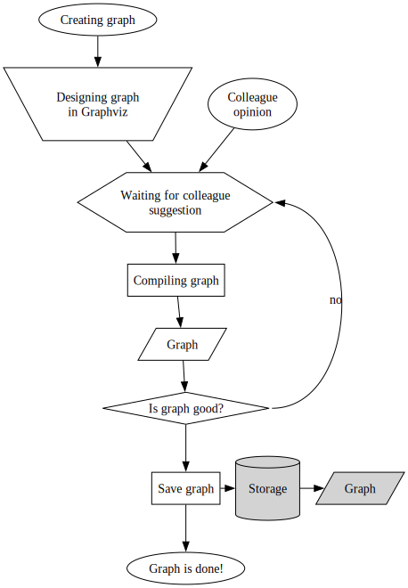
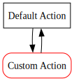
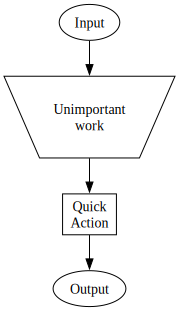

# Flowchart

> [!IMPORTANT]
This is an alpha. Soon, some macra names are going to change to reflect official box names more closely. Stay tuned!

Flowchart is a set of m4 macra made for Graphviz `.dot` files facilitating working, well, with flowcharts. It allows to:
* use pre-defined custom flowchart shapes ([ISO 5807](https://cdn.standards.iteh.ai/samples/11955/1b7dd254a2a54fd7a89d616dc0570e18/ISO-5807-1985.pdf)),
* define nodes inline,
* define flexible record-like structures using provided functionalities,
* embed flowcharts in your `.dot` files using `Graph` and `Process` macra.

# Required software
1. [Graphviz](https://www.graphviz.org) is an open source graph visualization software allowing you to compile graphs from a files in `.dot` format.
2. [m4 macro processor](https://www.gnu.org/software/m4/manual/m4.html) is a GNU preprocessor for editing text files.

You can install the software using official projects' pages or your package manager (APT, Homebrew/Macports etc).

# Examples

Refer to compiled examples in the `example` folder:

### Basic shapes:

```dot
include(shapes.m4)
digraph {
    /* node definitions */
    input Input("Creating graph")
    colleague Input("Colleague\nopinion")
    design Manual("Designing graph\nin Graphviz")
    ask Preparation("Waiting for colleague\nsuggestion")
    compile Action("Compiling graph")
    graph_result Data("Graph")
    is_good Decision("Is graph good?")
    save Action("Save graph")
    output Output("Graph is done!")
    /* database-related nodes definitions */
    Database(Storage) // note no quotation marks!
    stored_data Data("Graph", Storage)
    /* graph definition */
    input -> design -> ask -> compile -> graph_result -> is_good -> save -> output
    colleague -> ask
    subgraph store { rank=same save -> Storage -> stored_data }
    is_good:e -> ask:e [xlabel="no"]
}
```

### Use custom attributes with predefined macra:

```dot
include(shapes.m4)
digraph {
    default_action Action("Default Action")
    custom_action Action("Custom Action") [color=red, style=rounded]
    default_action -> custom_action -> default_action
}
```

### Inline node definition:

```dot
include(shapes.m4)
digraph {
    _Input("Input") -> _Manual("Unimportant\nwork") -> _Action("Quick\nAction") -> _Output("Output")
}
```
